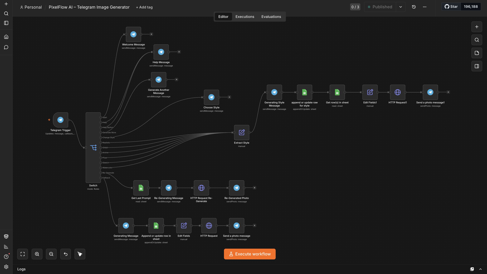
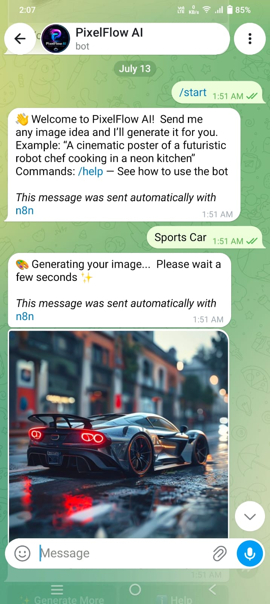
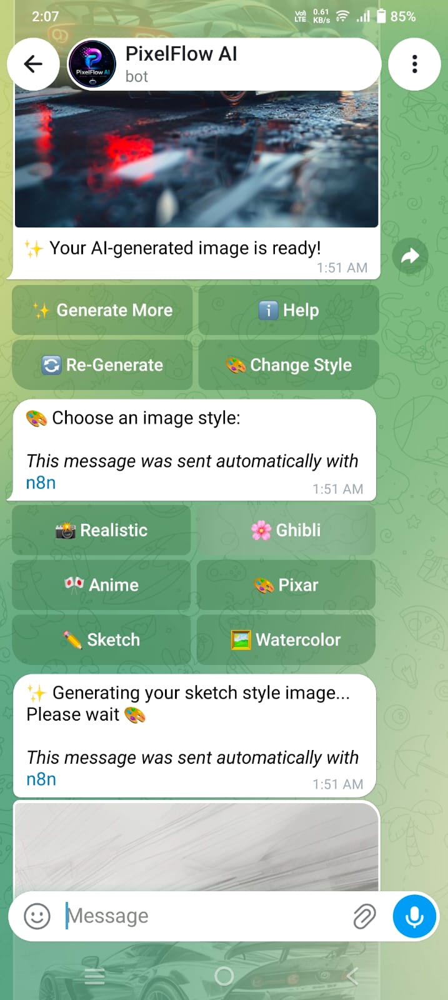
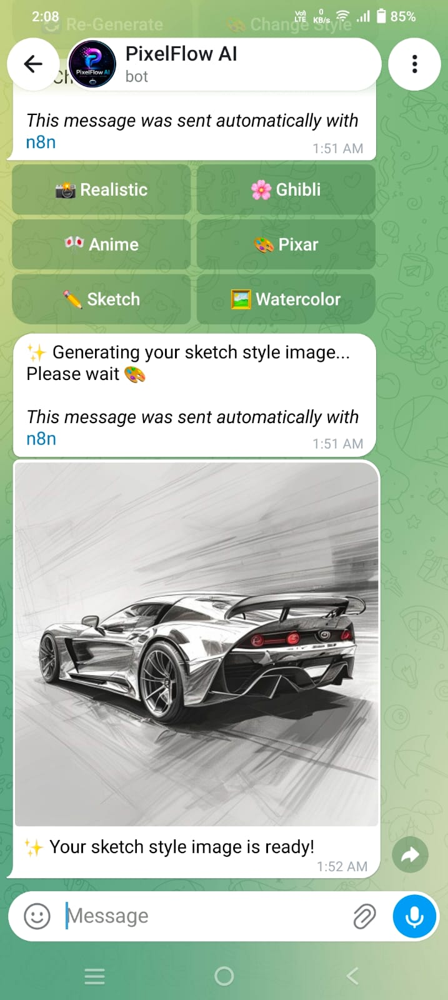

# 🎨 PixelFlow AI – Telegram Image Generator

Generate stunning AI images directly from Telegram with multiple artistic styles, one-click regeneration, and prompt memory powered by n8n automation.



---

## 📌 Project Note

This project was built to explore workflow automation with n8n and AI integrations.

The repository contains the implementation and source code used during development. The Telegram Bot is not currently deployed for public use.

Feel free to explore the code and workflow. If you'd like a walkthrough or demo, feel free to connect with me on LinkedIn.

---

## ✨ Features

- 🖼️ AI Image Generation from Telegram
- 🎭 6 Image Styles
  - Realistic
  - Ghibli
  - Anime
  - Pixar
  - Sketch
  - Watercolor
- 🔄 Re-Generate previous image
- ➕ Generate More
- 💾 Prompt Memory using Google Sheets
- 🎨 Change image style without typing the prompt again
- ❓ Help command
- ⚡ Fully automated with n8n
- 🤖 Telegram Inline Keyboard UI

---

## 📸 Screenshots

### Telegram Bot



### Style Selection



### Generated Images



---

## 🏗️ Architecture

```
User
   │
Telegram Bot
   │
n8n Workflow
   │
Google Sheets (Prompt Memory)
   │
Pollinations AI
   │
Telegram Response
```

---

## 🛠️ Tech Stack

- Telegram Bot API
- n8n
- Google Sheets
- Pollinations AI
- Cloudflare Tunnel (Development)
- Railway (Deployment)

---

## 📁 Project Structure

```
PixelFlow-AI-Telegram-Image-Generator/
│
├── assets/
├── workflow/          (Local Backup - Not Included in Repository)
├── .gitignore
├── env.example
├── LICENSE
└── README.md
```

---

## ⚙️ How It Works

1. User sends a prompt on Telegram.
2. Prompt is stored in Google Sheets.
3. n8n enhances the prompt.
4. Pollinations AI generates the image.
5. Image is sent back to Telegram.
6. User can:
   - Generate More
   - Re-Generate
   - Change Style
   - View Help

---

## 🎨 Supported Styles

| Style | Description |
|--------|-------------|
| Realistic | Photorealistic images |
| Ghibli | Studio Ghibli inspired |
| Anime | Anime illustration |
| Pixar | 3D animated look |
| Sketch | Pencil sketch |
| Watercolor | Watercolor painting |

---

## 🔒 Note

This repository is shared as a portfolio project.

The complete n8n workflow and production credentials are intentionally excluded from the public repository.

---

## 🚀 Future Improvements

- Aspect Ratio Selection
- Image History
- Favorite Images
- Multiple AI Providers
- HD Upscaling
- User Analytics

---

## 👨‍💻 Author

**Bhargav Vaghela**

